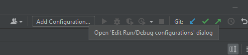
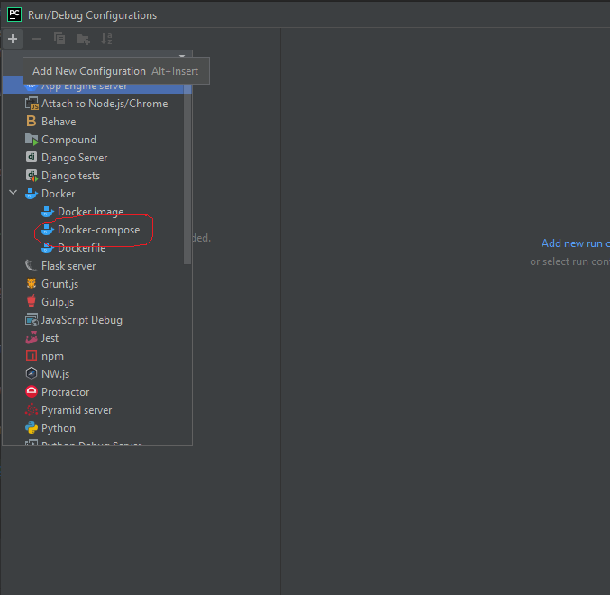
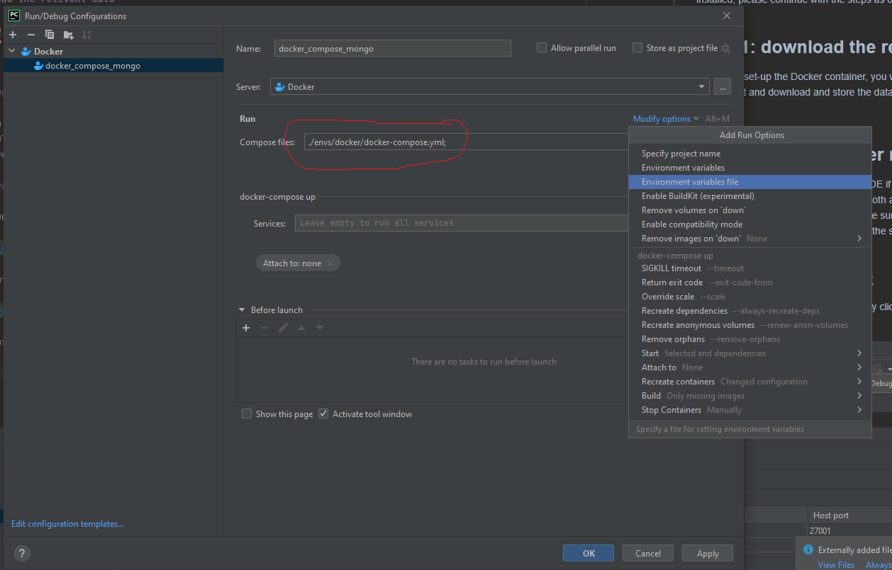
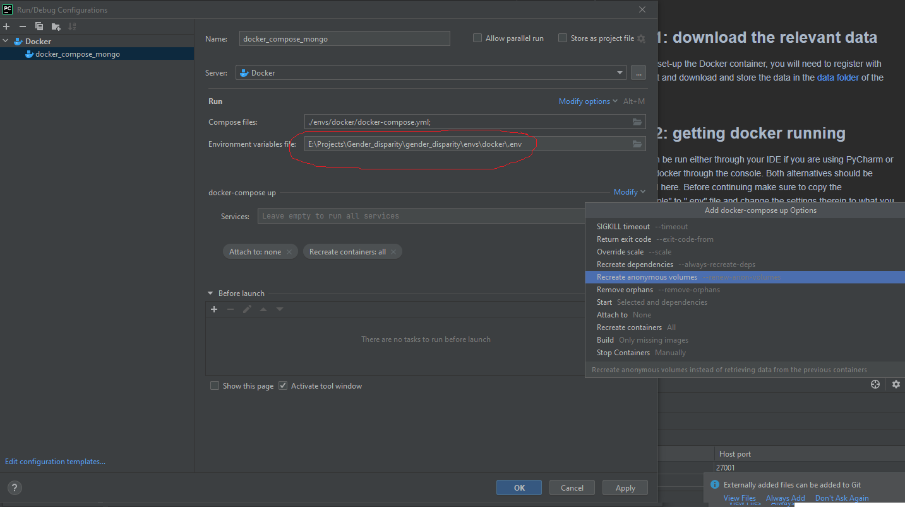
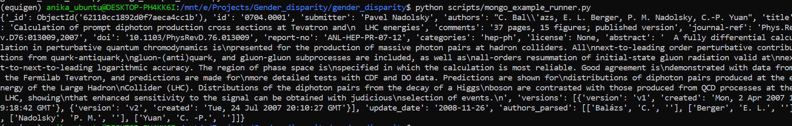

# MongoDB for efficient data handling

As described in the [resource summary](./docs/resources.md), a first step within this project is to assess the different
gender identification tools for their applicability in this project. We decided to use the [ArXiv
Kaggle dataset](https://www.kaggle.com/Cornell-University/arxiv) for now, in the absence of having investigated other 
data sources. 

In order to test the different tools with regards to performance and applicability to the task of gender recognition a
common data source should be used. To make the handling of the Arxiv data more efficient and easier for everyone, we are 
using MongoDB inside a Docker container for now so that data can be easily loaded.

In order to follow the instructions below, you will need to have [docker](https://www.docker.com/) and docker-compose 
installed on your machine. Once these are installed, please continue with the steps as outlined.


## Step 1: download the relevant data

For you to set-up the Docker container, you will need to register with Kaggle first and download and store the data in the 
[mongo_seed folder](./mongo_seed) of the directory this README.md file is in. 


## Step 2: getting docker running 

Docker can be run either through your IDE if you are using [PyCharm](https://www.jetbrains.com/pycharm/) 
or by calling docker through the console. Both alternatives should be considered here. Before continuing make sure to 
copy the ".env_sample" to ".env" file and change the settings therein to what you feel is most appropriate for your system.

### Running Docker through IDE

First open the run configuration editor, by clicking on "Add Configuration" as shown



Then "Add New Configuration" by pressing on the plus button and selecting a docker-compose configuration.



A new dialog opens in consequence where the following details need to be added: 
* the compose file of the project in this folder
* the environment file that you copied before
* enforcing recreation of docker containers and
* removing orphans




All you need to do now is basically selecting the Run Configuration that you just created and pressing the start button.

### Running docker through command line

The run illustration below has been conducted on Windows Subsystem Linux (WSL), that runs a Ubuntu bash shell by default.
The same docker installation is used as the one accessed through PyCharm. First of all, change to the docker directory in 
the cloned GitHub repository:

```
cd <PATH_TO_GIT_REPO>/envs/docker
```

Then build the MongoDB container and load all the data with:

```
docker-compose up --build
```

Once you see that the import has finished (see the following image for comparison), you are ready to run Python 
scripts against your MongoDB instance and the articles therein.


## Step 3: Run the example

As I am using the Professional version of PyCharm, I have configured my run environment to connect with WSL2 Ubuntu shell
(as described [here](https://www.jetbrains.com/help/pycharm/using-wsl-as-a-remote-interpreter.html))
so that whenever I trigger a run, the scripts are executed in a bash shell. 

Furthermore, since I am working on multiple projects, I prefer to work with environments for Python to save package 
versions used to execute code. To manage the different environments, I use 
[miniconda](https://docs.conda.io/en/latest/miniconda.html). There is a [conda environment export](../conda) committed 
to the project, containing all the Python packages used so far. It would be great if we could add to this file as we go 
along. To use this file, install conda first and then navigate to your local folder containing the conda environment 
file. 

To run the example, either use your IDE or type 

```
python scripts/mongo_example_runner.py
```

on a console where you have moved into the root directory of the repository. Running the script will retrieve
one article of the "articles" collection and print all its related data as illustrated:




